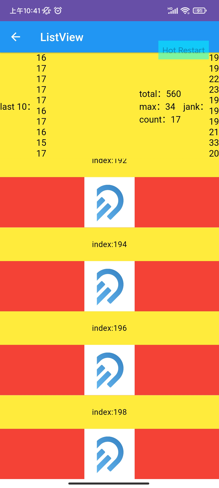
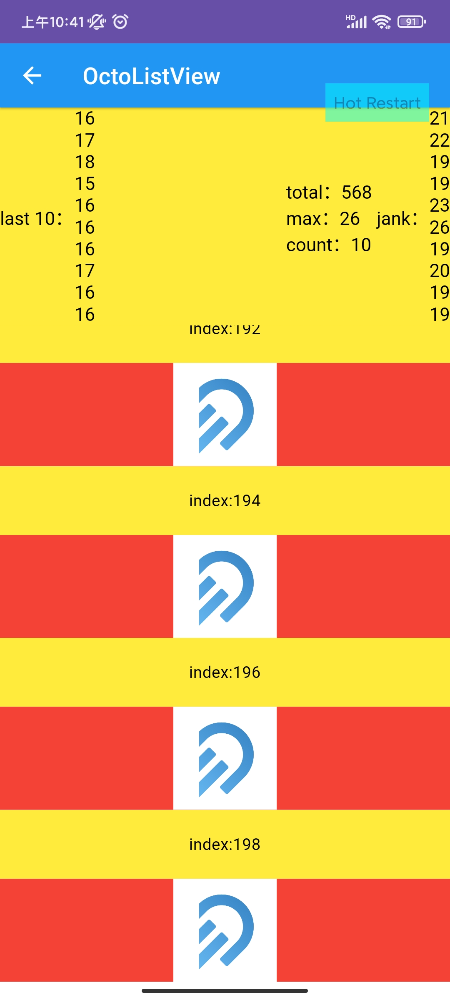
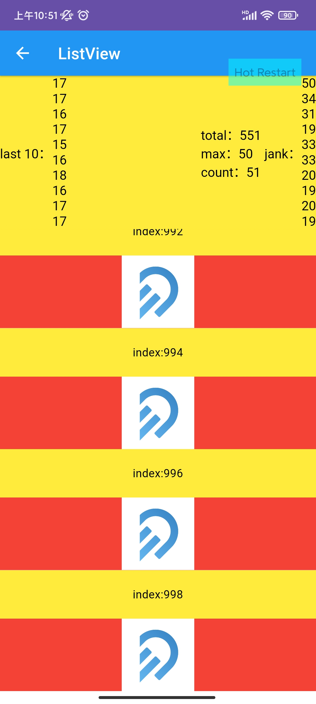
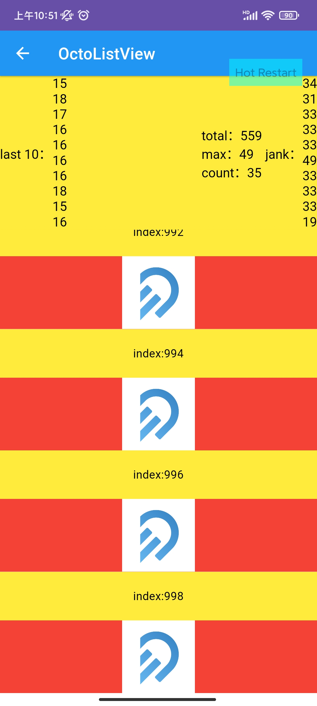
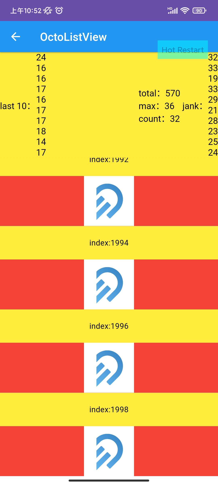
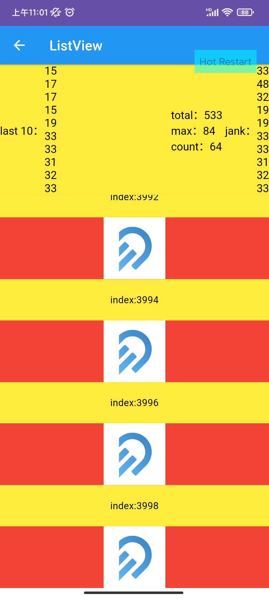
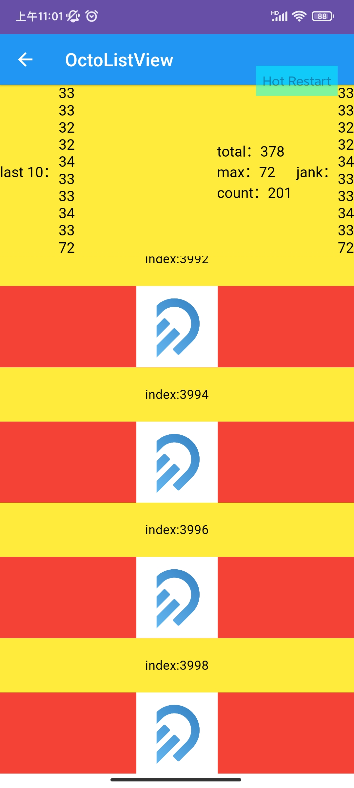

## octoflutter list benchmark

### When the list length is 200

  

### When the list length is 1000

  

### When the list length is 2000

  

### When the list length is 4000
  

### Conclusion

Generally speaking, when the list length is small, OctoListView has less jank frame then ListView, and the longest time cost is smaller then ListView. When the list length come to 4000, even though the longest time cost is smaller then ListView, the jank frame is more then ListView. You should do some test based on your usage scenarios to decide to use ListView or OctoListView.