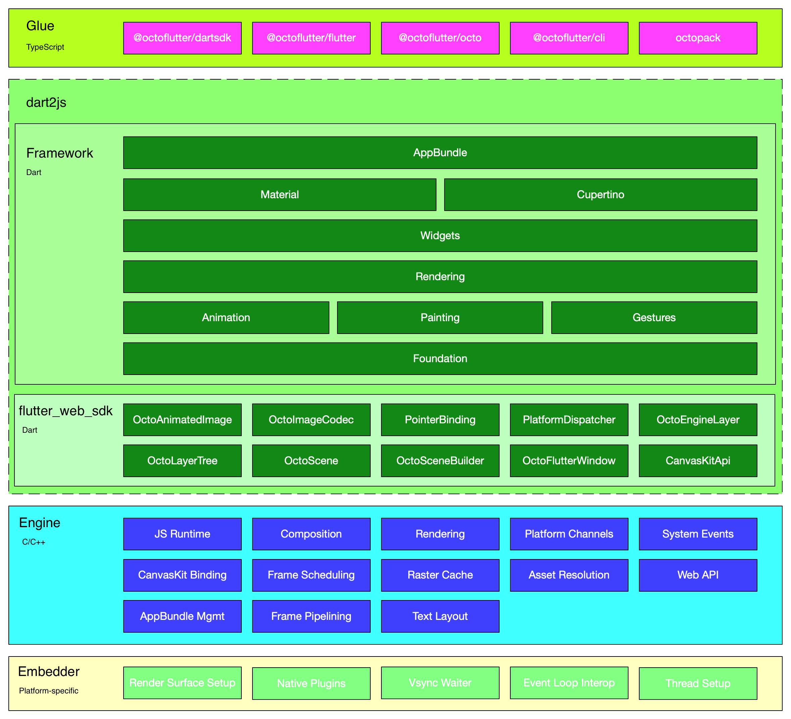
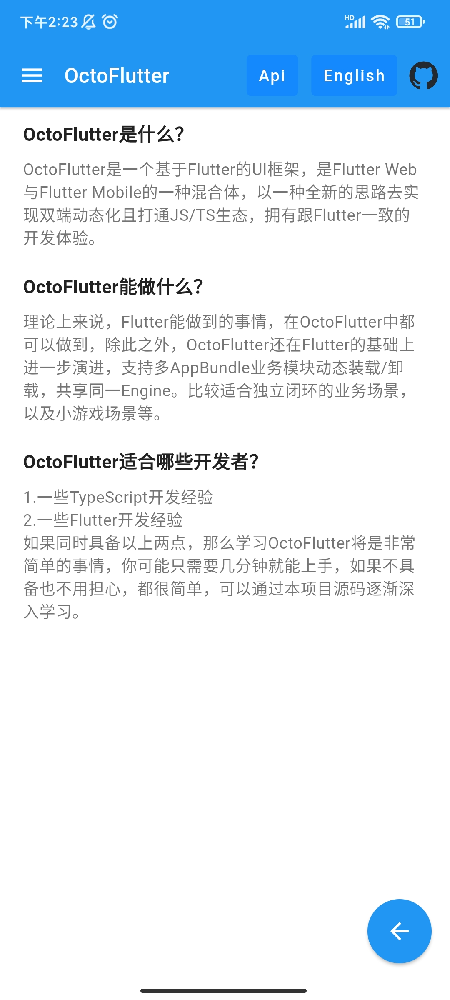
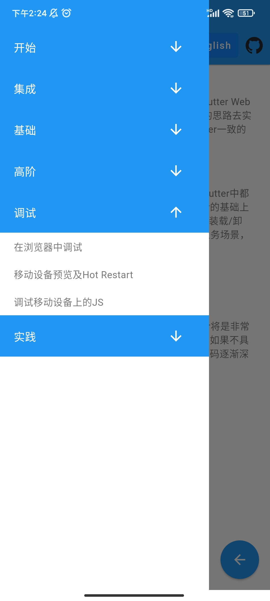

<a href="https://octoflutter.izuiyou.com">
  <h1 align="center">
    <picture>
      
    </picture>
  </h1>
</a>

### OctoFlutter [English](../../README.md)

OctoFlutter是Flutter Web与Flutter Mobile的一种混合体，通过全新的思路去实现双端动态化且打通JS/TS生态，并具备动态装载/卸载各种AppBundle业务模块的能力。

### 架构图


### 快速上手
1.创建模版工程
   ```shell
   pnpm add -g @octoflutter/cli #pnpm 安装 https://pnpm.io/installation#using-npm
   pnpm octoflutter create app
   cd app
   pnpm install
   ```
2.在web模式下预览UI
   ```shell
   pnpm dw #under app root dir
   ```
  浏览器打开http://localhost:54321查看

3.构建适合移动设备运行的业务产物
   ```shell
   pnpm dm #under app root dir
   ```
4.在移动设备上运行业务
  * 运行example目录下的octoflutter-android/octoflutter-ios工程
  * 安装app，运行，配置开发机的IP地址（用于请求第三步构建的业务产物）
  * 打开app，点击按钮 "Launch Remote AppBundle"

### 文档
* [OctoFlutter开发者文档](./documentation.md)
* [进一步了解OctoFlutter](./octoflutter.md)
* [常见问题及注意事项](./question.md)
* [路线规划](./roadmap.md)

### 实践
  


### 开源范围
目前OctoFlutter胶水层完全开源的状态，开发者可以使用OctoFlutter的完整能力。

### 联系我们

邮箱: octoflutter@xiaochuankeji.cn

### 许可协议

OctoFlutter基于[BSD](../../LICENSE)开源许可证协议。
